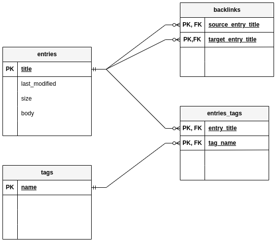

# eolas-db

This CLI application parses entries in my
[zettelkasten](https://github.com/thomasabishop/eolas) and extracts key metadata
about each entry. It creates and populates an SQLite database and offers different options for
exporting representations of the relations.

## Local development

```sh
source venv/bin/activate
python3 src/cli.py [opts]
```

## Production

### Generate single executable

```sh
source venv/bin/activate
pyinstaller --onefile ${HOME}/repos/eolas-db/src/cli.py --name eolas-db [opts]
```

### Run executable

```sh
${HOME}/repos/eolas-db/dist/eolas-db
```

Or:

```sh
sudo mv ${HOME}/repos/eolas-db/dist/ /usr/local/bin
eolas-db  [opts]

```

## Options

### `populate`

Parse entries and extract key metadata and body text, import into database
tables.

### `generate-graph`

Output a network graph of connections between entries and tags

### `export-tags`

Export a one-to-many JSON object of tags to entries.

## ERM



## Resources

https://www.digitalocean.com/community/tutorials/how-to-use-the-sqlite3-module-in-python-3
